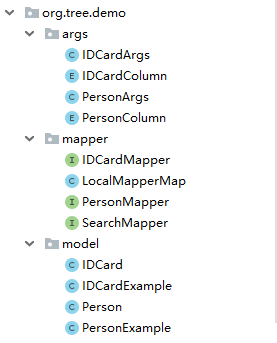

# 介绍
API 详情见 [feature.md](./feature.md)

# 安装
```bash
cd commons/
mvn install
```

# 使用
* 添加 Maven 依赖
```xml
    <dependency>
        <groupId>org.tree</groupId>
        <artifactId>commons</artifactId>
        <version>1.0.0</version>
    </dependency>
```
* 在 beans.xml 或 applicationContext.xml 中添加下列语句
> <context:component-scan base-package="org.tree.commons.support.mapper"/>
* 在 ./src/test 下建立如下结构：（用于正逆向工程，建议不要建在 main 下）
```
src/test
    |_ java
        |_ generate
            |_ model
                |_ Person.java ( pojo )
                |_ IDCard.java ( pojo )
            |_ Generate.java ( driver )
    |_ resources
        |_ conf.properties ( configure )
```
1. Person.java
```java
package generate.model;

import org.tree.commons.generate.annotation.Column;
import org.tree.commons.generate.annotation.Table;

@Table(name = "tb_person", comment = "公民")
public class Person {
    
    @Column(id = true)
    long id; // id 需要为 long 类型

    @Column(comment = "身份证的 id")
    long idCard_id;

    @Column(comment = "名字", length = 20)
    String name;

    @Column(defaultValue = "1", comment = "性别（0：女；1：男）")
    byte sex;

}
```
2. conf.properties
```
# 假设 root package 为 org.tree.demo
generate.root.package=org.tree.demo

# 假设使用的是 Maven 多模块的项目，要生成在模块 demo-base 下
generate.module=demo-base

jdbc.url=jdbc:mysql:///demo?characterEncoding=utf-8
jdbc.driver=com.mysql.jdbc.Driver
jdbc.username=root
jdbc.password=
```
3. Generate.java
```java
package generate;

import org.tree.commons.generate.generator.TableGenerator;

public class Generate {
    public static void main(String[] args) throws Exception {
        
        /* 扫描 generate 包及其子包 */
        TableGenerator generator = new TableGenerator(Generate.class.getPackage().getName());
        generator.setConfigProperties("conf.properties");
        
        generator.forward();    //  正向工程，根据扫描到的 @Table 来生成表，类似于 hibernate，只支持 mysql
        generator.reverse();    //  逆向工程，对 mybatis-generator 的封装
    }
}
```
* 执行 Generate 的 main 方法后将生成如下结构

    
   
P.S. XxxArgs, XxxColumn 和 XxxExample 一样是自动生成的。可用于连表查询或可选参数查询。

1. Person.java
```java
package org.tree.demo.model;

import org.tree.commons.annotation.Comment;

public class Person {
    private Long id;

    @Comment("身份证的 id")
    private Long idcardId;

    @Comment("名字")
    private String name;

    @Comment("性别（0：女；1：男）")
    private Byte sex;
    
    // getter && setter

}
```
2. PersonMapper.java
```java
package org.tree.demo.mapper;

import java.util.List;
import org.apache.ibatis.annotations.Param;
import org.tree.commons.support.mapper.BaseMapper;
import org.tree.demo.args.PersonArgs;
import org.tree.demo.model.PersonExample;
import org.tree.demo.model.Person;

public interface PersonMapper extends BaseMapper<Person> {
    
    // normal method
    
    // ......
    
    // new method

    List<Person> querySelective(@Param("args") PersonArgs args, @Param("example") PersonExample example);

    int insertSelectiveWithGeneratedKey(Person person);

    int insertBatchSelective(List<Person> records);
}
```
* 使用
```java
public class BaseTest {
    
    private static final ApplicationContext context = new ClassPathXmlApplicationContext("beans.xml");
    
    @Test
    public void printPersonName() {
        // 检索并打印所有 Person 的名字
        PersonMapper mapper = context.getBean(PersonMapper.class);
        List<Person> persons = mapper.querySelective(new PersonArgs().setName(true), new PersonExample());
        persons.stream().map(Person::getName).forEach(System.out::println);
    }
    
    @Test
    public void printPersonIDNumber() {
        // 检索并打印所有 Person 的身份证号码
        UnionSearchMapper mapper = context.getBean(UnionSearchMapper.class);
        UnionSearch unionSearch = new UnionSearch(mapper);
        unionSearch.selectColumns(new IDCardArgs().setNumber(true));
        unionSearch.createCriteria().and(PersonColumn.IDCARD_ID, " = ", IDCardColumn.ID);
        List<IDCard> result = unionSearch.query(IDCard.class);
        result.stream().map(IDCard::getNumber).forEach(System.out::println);
    }
    
    @Test
    public void select() {
        // IntegratedMapper 是对所有 Mapper 的封装，通过泛型来判断使用哪个 Mapper 来执行
        IntegratedMapper mapper = context.getBean(IntegratedMapper.class);
        List<Person> persons = mapper.selectByExample(new PersonExample());
        List<IDCard> idCards = mapper.selectByExample(new IDCardExample());
    }
}
```